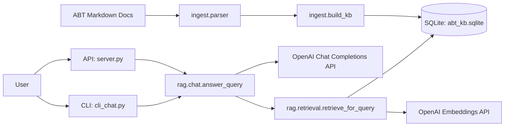
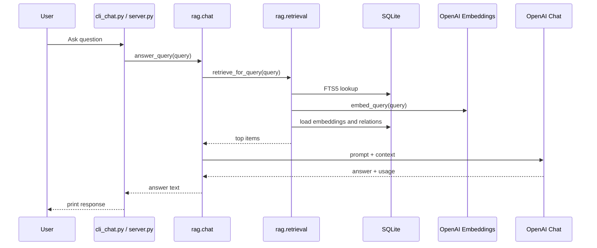
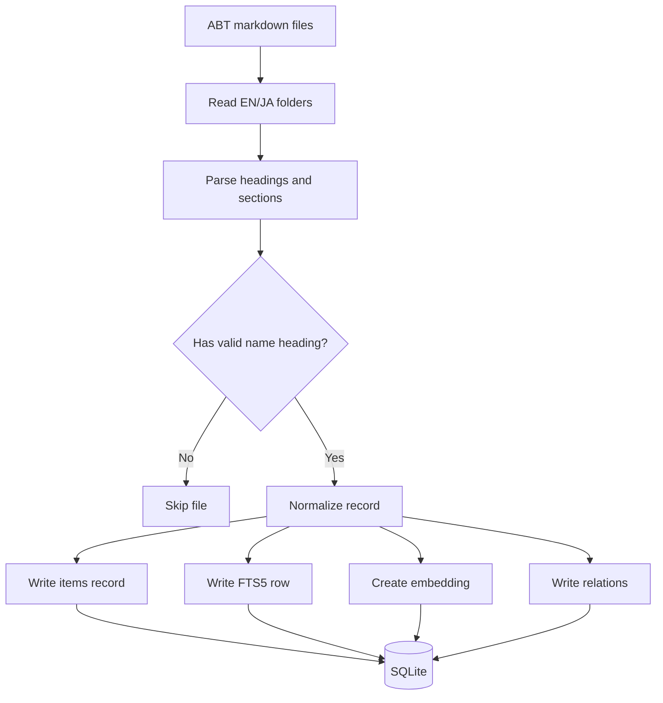

# Hybrid RAG Technical Specification

## 1. Purpose

This project provides a hybrid retrieval-augmented generation assistant for TestArchitect BIA/BIS documentation.
It supports two user entry points:

- CLI chat via `cli_chat.py`
- HTTP API via `server.py`

The system ingests markdown documentation, stores structured records in SQLite, retrieves relevant items with a hybrid search strategy, and sends a compact context to the OpenAI chat model.

## 2. Scope

### In scope

- Markdown ingestion from the `ABT/` documentation tree
- SQLite knowledge base construction
- Hybrid retrieval using lexical search, embeddings, and graph expansion
- LLM answer generation
- Token usage logging

### Out of scope

- Web UI
- Distributed storage
- Background scheduling
- Human review workflow

## 3. Architecture

## 4. Main Components

### 4.1 Ingestion

- `ingest/parser.py` parses EN/JA markdown files.
- `ingest/build_kb.py` builds and refreshes the SQLite knowledge base.
- Parsed records are normalized into item metadata, raw text, embeddings, and relations.

### 4.2 Storage

SQLite database file:

- `abt_kb.sqlite`

Tables:

- `items`
- `items_fts`
- `embeddings`
- `relations`

### 4.3 Retrieval

- `rag/retrieval.py` performs hybrid retrieval.
- It combines:
  - FTS5 lexical ranking
  - embedding similarity
  - relation-based expansion
- The chat layer merges duplicate logical items before prompting so the same action/setting does not appear twice when multiple sources point to the same canonical item.

### 4.4 Generation

- `rag/chat.py` builds a compact prompt from retrieved items.
- The assistant uses a fixed system prompt and the retrieved documentation snippets.
- Token usage is printed to stderr for observability.

## 5. Data Model

### 5.1 `items`

Stores structured item metadata and the serialized JSON payload.

When the same logical item is present in more than one source, the answer layer treats it as one canonical item keyed by `kind + folder_category + slug`.

### 5.2 `items_fts`

FTS5 index over names, descriptions, and raw locale text.

### 5.3 `embeddings`

Stores one embedding vector per item.

### 5.4 `relations`

Stores graph edges such as `USES_SETTING`.

## 6. Query Workflow

### Query behavior

1. The user enters a natural-language question.
2. The retriever converts the text into a safe FTS query.
3. FTS5 returns lexical candidates.
4. The query is embedded and compared against stored embeddings.
5. Scores are combined into a hybrid ranking.
6. Related records are expanded through `relations`.
7. The chat layer compresses the retrieved data into a short context.
8. The LLM answers from the provided context only.

## 7. Ingestion Workflow

### Ingestion behavior

1. Parse the markdown tree under `DOCS_ROOT`.
2. Skip documents that do not contain a valid `###` heading.
3. Merge EN and JA content into one record per logical item.
4. Insert structured rows into SQLite.
5. Generate and store embeddings.
6. Create graph relations for applicable settings.

## 8. Prompt Budget Strategy

The chat layer is intentionally compact to reduce input tokens:

- retrieved item count is capped
- relation expansion is capped
- descriptions are truncated
- arguments and controls are limited
- the prompt wrapper is short and stable
- duplicate logical items are merged before prompt construction
- reference links are rendered from canonical TestArchitect docs URLs instead of local file paths

Token usage is logged after each model call:

- input tokens
- output tokens
- cached prompt tokens
- total tokens

## 9. Configuration

Environment variables:

- `OPENAI_API_KEY`
- `DOCS_ROOT`
- `OPENAI_MODEL_CHAT`
- `OPENAI_MODEL_EMBED`

Defaults are defined in `config.py`.

## 10. Runtime Entry Points

- `python -m ingest.build_kb`
- `python cli_chat.py`
- `uvicorn server:app --reload --port 8000`

## 11. Operational Notes

- Rebuild the knowledge base after changing source markdown.
- Keep the system prompt stable to improve cache reuse.
- If retrieval context becomes too large, prefer trimming snippets before raising model temperature or response length.
